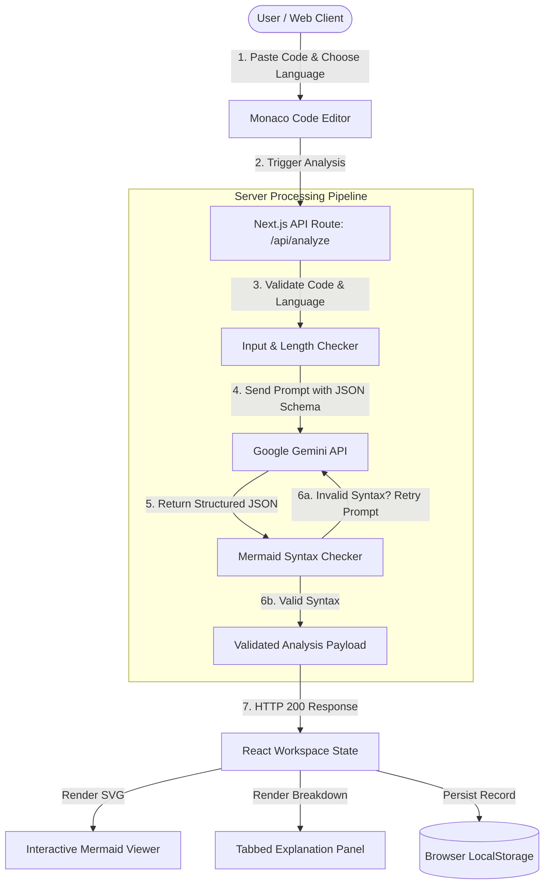

# FlowSight – System Architecture & Design Documentation

FlowSight is engineered following **Clean Architecture** principles and Next.js App Router best practices, decoupling the frontend state management, code editing engine, diagram rendering layer, and AI processing pipeline.

---

## 🏛️ System Architecture Diagram

---

## 🔑 Core Design Decisions

### 1. Monaco Editor Integration
* **Why**: Provides a native IDE experience with automatic language-specific token highlighting, auto-indentation, line numbering, and file drag-and-drop support.
* **Implementation**: Uses `@monaco-editor/react` with dynamic language mode mapping (`python`, `javascript`, `java`, `cpp`, `c`).

### 2. Interactive Mermaid Diagram Viewer with Vector Pan & Zoom
* **Why**: Raw SVG diagrams can get wide or tall for complex algorithms. Providing zoom in/out, panning, reset, and full-screen controls ensures high usability.
* **Implementation**: Combines `mermaid.render()` with `react-zoom-pan-pinch` wrapper for fluid CSS transform controls.

### 3. Serverless Gemini API Route with Automatic Retry Loop
* **Why**: LLMs occasionally produce invalid Mermaid flowchart syntax (unquoted special characters or unclosed brackets). To prevent client-side diagram crashes, the server validates the output before returning it to the user.
* **Implementation**:
  1. `app/api/analyze/route.ts` sends strict system rules instructing Gemini to produce valid `flowchart TD` syntax inside a structured JSON payload.
  2. The server runs `isValidMermaidSyntax()`.
  3. If syntax errors exist, a prompt feedback correction is sent to Gemini automatically.

### 4. Client-Side History Persistence
* **Why**: Users should be able to revisit previous analyses without re-querying the AI API.
* **Implementation**: LocalStorage wrapper in `utils/storage.ts` manages a maximum of 25 records with full search and filter functionality.
