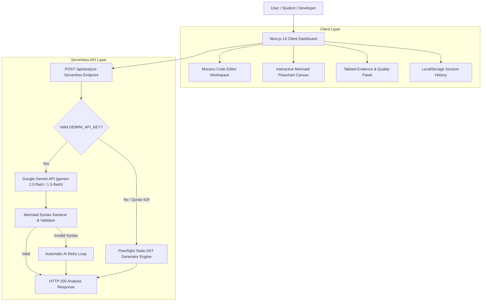

# FlowSight – System Architecture & Design Rationale

FlowSight is built using **Clean Architecture** principles to separate client UI presentation, diagram rendering engines, AI inference API routes, and local static AST fallback parsing.

---

## 🏛 System Architecture Overview

---

## 🧩 Architectural Layers & Component Responsibilities

### 1. Presentation & UI Layer (`components/`)
* **`Header.tsx`**: Top navigation navbar featuring high-contrast branding, status indicators, and History drawer trigger.
* **`CodeEditor.tsx`**: IDE-grade source code editor powered by `@monaco-editor/react`. Handles language mode switching (`python`, `javascript`, `java`, `cpp`, `c`), file uploads, line/character counters, and sample algorithm loading.
* **`FlowchartViewer.tsx`**: SVG diagram viewport powered by `mermaid` and `react-zoom-pan-pinch`. Supports vector zoom/pan/reset, **Top-Down (TD)** vs **Left-to-Right (LR)** layout toggling, raw Mermaid copy, and **SVG/PNG downloads**.
* **`ExplanationPanel.tsx`**: Tabbed presentation component rendering Overview, AI Quality Scorecard (0–100), Code Metrics, Detected Algorithms & OOP Concepts, Variables, Control Flow, and Security Audit.
* **`HistorySidebar.tsx`**: Drawer for client-side analysis persistence with real-time keyword search and filtering.

### 2. Serverless API & AI Layer (`app/api/analyze/route.ts`)
* Implements system prompt engineering enforcing **evidence-based dynamic analysis** (no false or guessed features).
* Manages multi-model candidate retry loop (`gemini-2.0-flash`, `gemini-1.5-flash`).
* Automatically catches API quota limits (`429`) or missing keys and seamlessly delegates to the local static AST fallback generator.

### 3. Static AST & Resiliency Engine (`utils/static-flowchart-generator.ts`)
* Rule-based static parser evaluating source code tokens via regular expressions and AST rules.
* Detects project types, classes, methods, loop counts, conditional nesting depth, security risks, and code smells.
* Calculates quality scorecard metrics and constructs valid Mermaid `flowchart TD` syntax without network latency.

### 4. Data Storage & Utility Layer (`utils/storage.ts` & `utils/mermaid-validator.ts`)
* **`storage.ts`**: Encapsulates `localStorage` CRUD operations for up to 25 analysis items.
* **`mermaid-validator.ts`**: Sanitizes node labels, removes invalid HTML/markdown quotes, and validates flowchart syntax integrity.

---

## 🛡️ Reliability & Uptime Safeguards

1. **Zero-Latency Fallback**: Guaranteed HTTP 200 output availability even when third-party AI APIs hit rate limits.
2. **Mermaid Retry Loop**: Automatic syntax correction if initial AI output generates invalid diagram syntax.
3. **Pure White High-Contrast Design**: High visibility optimized for screen sharing, faculty presentations, and viva demonstrations.
